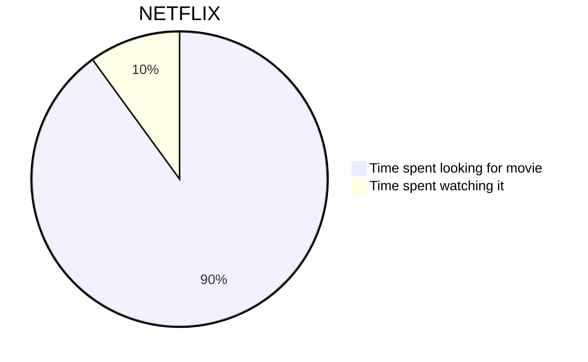
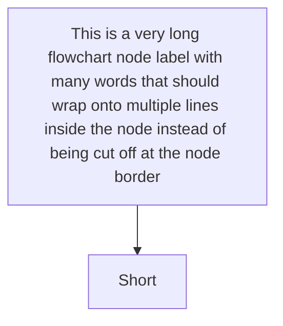

# Test 3

```mermaid
pie title NETFLIX
   "Time spent looking for movie" : 90
   "Time spent watching it" : 10
```

```mermaid
flowchart TD
  A[This is a very long flowchart node label with many words that should wrap onto multiple lines inside the node instead of being cut off at the node border] --> B[Short]
```
